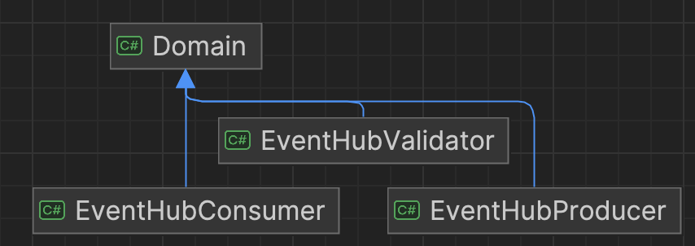
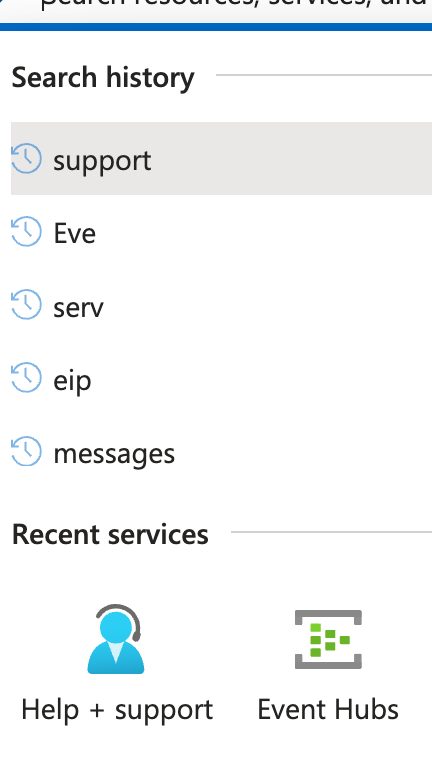
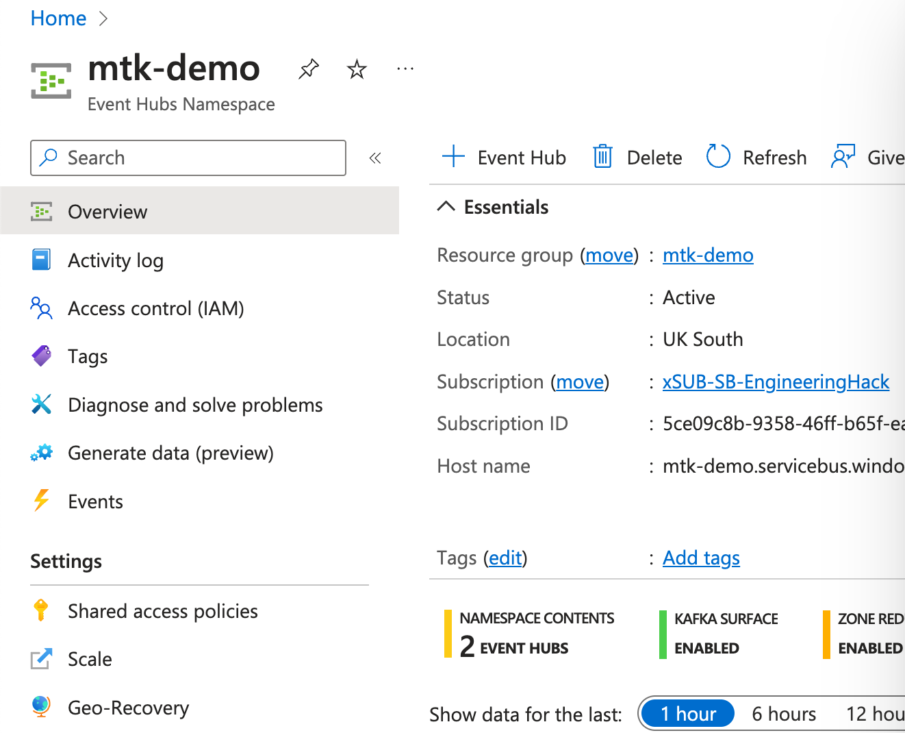
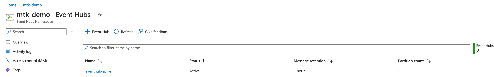

## Introduction

This is a simple Azure Event Hub C# solution to help with understanding how simple Producers and Consumers will work with Event Hubs. 

Azure Event Hubs is **a cloud native data streaming service that can stream millions of events per second, with low latency, from any source to any destination**. Event Hubs is compatible with Apache Kafka, and it enables you to run existing Kafka workloads without any code changes.

## Environment

- Build project with .net 8

- Run EventHubConsumer with argument  `--with-reload=true` if you want the existing data to automatically reload from the beginning using event sourcing or false for the last offset

- There are three projects with a domain dependency

  

- You will need to configure AppSettings with Azure Event Hub Connection string and the Event Hub Instance, see instructions for setting this up quickly

## Azure Event Hub quick setup

This is not for production purposes, but for the purpose of running the Spike with the least amount of effort. For production, please take more care to refine the details needed.

1. https://portal.azure.com/

2. Setup a free account, but ideally utilise a proper account

3. Navigate to Event Hubs

   

4. Create a standard namespace e.g. mtk-demo

   

5. Create an Event Hub instance

   

6. Copy the names and connection string into AppSettings everywhere it is needed and experiment with what ever values you need to get this to work

