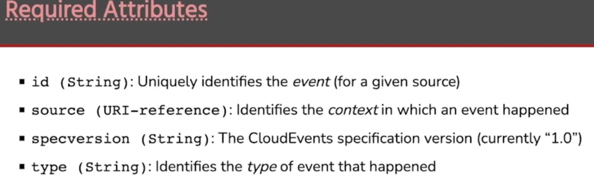
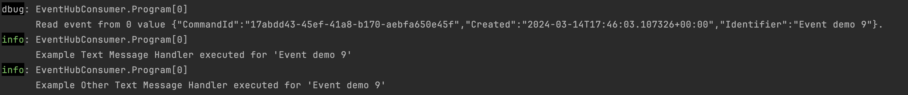

# EDAExercise
**Event Driven Architecture Exercise** is about exploring the latest event driven patterns with a few bits of tech and a library. Key decisions where taken before hand to help focus this discussion but the details can be understood in the demo samples attached.

1. Utilise [Streaming instead of Messaging](https://risingwave.com/blog/differences-between-messaging-queues-and-streaming-a-deep-dive/) inorder to facilitate event sourcing patterns and horizontal scaling
   - **Messaging Queues**: Messaging queues are a form of middleware that handle messages (data packets) between applications. They ensure that messages sent from a producer service are properly received by a consumer service, even if the consumer is not ready to process them immediately.
   - **Streaming**: Streaming is the continuous transfer of data where data can be processed as it comes in. Streaming platforms allow for real-time data processing, allowing immediate insights and actions based on the incoming data.
2. Utilise [Azure Event Hubs](https://learn.microsoft.com/en-us/azure/event-hubs/event-hubs-about) and [Azure Service bus](https://learn.microsoft.com/en-us/azure/service-bus-messaging/service-bus-messaging-overview) to facilitate the above as well as patterns for throttling
3. Investigate [Kafka](https://kafka.apache.org/) and [Confluent Kafka](https://www.confluent.io/) as alternatives to achieving the same result
4. Utilise a library called [Masstransit.io](https://masstransit.io/) for quick intoduction to patterns on easily accesing consumer and producer patterns and a lot more

## Architectural high level requirments

Below is a very high level diagram representing where this will fit and what the purpose of the event mechanism will be. The future of this could extend to a lot of services but in this narrow vertical, it was SAP -> Product Domain Service -> Search Domain Service. 


The base requirements and ways of working:

1. SAP, as an example,  or **entry system** and tool for creating contracts for providing Product data or source data
   - Investigate https://cloudevents.io/
   - Investigate https://github.com/cloudevents/spec
   - Investigate https://github.com/cloudevents/spec/blob/v1.0.2/cloudevents/bindings/kafka-protocol-binding.md
2. How do we communicate **Topics** or Eventhub **Instances** and **Namespaces**?
3. How does this get created from SAP to the Product Domain Service?
   - Via **REST** or an API facilitated with the Product Domain Service?
   - Using Azure Event Hub direct as a **Producer**?
   - **Other** SAP/Entry Service mechanism?
4. How does the **Product Domain Service** show its healthy?
   - What happens when it is down and how can it fail - Azure Event Hub is down?
   - What happens when it fails half way?
   - How long do we persist information? How do we read the data, is it by the last offset, by date or all the data ever created into Eventhub by the configured durability or all three by some dynamic argument?
   - What groups do we create and why do we create these groups?
   - What partitions do we create and which partition applies to who?
   - What happens when the event validation does not succeed like data is missing or the schema changes?
5. How do we keep the schema versioned?
6. Who has permission to read, write and own the events?

## Data Validation

Any communication between components running as different processes involves serialization and deserialization. For the time being, JSON is the most popular data format for cross-service communication, but its performance is not always sufficient, so sometimes it is better to consider binary formats to minimize payload size and improve serialization/deserialization time.

I will be comparing the following formats:

- **JSON** — using [Newtonsoft.Json](https://www.newtonsoft.com/json) and the standard [System.Text.Json](https://docs.microsoft.com/en-us/dotnet/api/system.text.json?view=net-6.0)
- **BSON** — using [MongoDB.Bson](https://www.nuget.org/packages/mongodb.bson/)
- **Protobuf** — using [protobuf-net](https://github.com/protobuf-net/protobuf-net)
- **Avro** — using [Apache.Avro](https://github.com/apache/avro) and [Chr.Avro](https://github.com/ch-robinson/dotnet-avro)

The final solution based on popularity, but not performance, is JSON and that is based on this body of [evidence](https://blog.devgenius.io/serialization-performance-in-net-json-bson-protobuf-avro-a25e8207d9de) and this is very evident within https://github.com/gregsdennis/json-everything?tab=readme-ov-file.

## What are Cloud Events?

The reason we need this step well understood, is because from left to write, SAP drives the Domain service contract. The contract then needs to be refctored into something that will facilitate Search and so each has a dependancy. So how do we communicate this or standerside this? Hence Cloud Events.

Investigated 

- [CloudEvents](https://cloudevents.io/) 
- [cloudevents/spec](https://github.com/cloudevents/spec) 
- [kafka-protocol-binding.md](https://github.com/cloudevents/spec/blob/v1.0.2/cloudevents/bindings/kafka-protocol-binding.md) 

After looking at the API, and a [short video](https://www.youtube.com/watch?v=qJe98hb92uk) on it, I feel this is overkill for most organisations. With the use of Confluence, the data validation using Avro or JSON Schema, all this becomes unnecessary. What I felt was important, is you should always version or create markers to indetify changes and have base attributes that help with changes.



## What Spikes have been done to understand the technical requirements?

Many of the questions asked above have been awnsered specifically with POC code or spikes. Below, this will be evaluated and examples will be available for  usage, however none of the Cloud settings will be available, but should be simple to setup manually without too much complexity. I will try add instractions within the README's to help set this up for trialing and ivestigating.

### Create a Producer for Azure Event Hub

The producer is simple and just utilises the default [EventHubBufferedProducerClient](https://github.com/Azure/azure-sdk-for-net/blob/main/sdk/eventhub/Azure.Messaging.EventHubs/samples/Sample04_PublishingEvents.md#event-hub-buffered-producer-client) from the SDK. I left this simple as this simply takes a connection string and topic/event hub instance name.

```c#
_producer = new EventHubBufferedProducerClient(connectionString, eventHubName);

... await _producer.EnqueueEventAsync(eventData);
```

The full example can be seen [here](./EventHubSpike/EventHubProducer)

### Create a Consumer for Azure Event Hub

The consumer was more advanced in the sense that it was broken into discoverable Consumers by the generic Consumer interface and a bespoke `EventHubConsumerProvider<TestMessage>` was created to encapsulate all the consumer logic in future as a sample for easily configuring and discovering the consumers. This could be replaced very simply with some sort of mediator or command pattern for achieving this. Read more in the SDK strategies available [here](https://github.com/Azure/azure-sdk-for-net/blob/main/sdk/eventhub/Azure.Messaging.EventHubs/samples/Sample05_ReadingEvents.md#read-events-from-all-partitions).

```c#
// Simple consumer discovery by reflection
var consumers = ConsumerDiscovery
    .DiscoverConsumers<TestMessage>(_logger)
    .ToArray();

// Configuring the provider with all the consumers as a discoverable list of consumers
_testMessageConsumerProvider = new EventHubConsumerProvider<TestMessage>(
    _connectionString,
    EventHubConsumerClient.DefaultConsumerGroupName,
    _eventHubName,
    _logger,
    consumers!  // or new ExampleConsumer(_logger), new ExampleOtherConsumer(_logger)
  
// Configuring dynamic ways to read the streamed events from the beginning or at the end 
// showing the event sourcing and the way this works when events get fired
using var cancellationSource = new CancellationTokenSource();
    await (
        withReload
            ? _testMessageConsumerProvider.ReadMessagesFromAllPartitions(
                cancellationSource.Token
            )
            : _testMessageConsumerProvider.ReadMessagesAfterLatestOffset(
                cancellationSource.Token
            )
    );
```



The Consumer itself can be decorated with an `IConsumer<Model>` interface with patterns that validate and make sure if any errors occur that it is logged.

```c#
// A simple example expanding on logging with async patterns
public class ExampleConsumer(ILogger logger) : IConsumer<TestMessage>
{
    public Task ExecuteAsync(TestMessage data)
    {
        // Always catch errors to prevent blocking other consumers
      	// or we can do this in the code that iterates over the list to make it more reliable
        try
        {
            // An example of checking via data annotations or json schema, what you expected is here or this can
            // be configured in Event Hub and always correct from here on through Schema validation mechanisms
            if (data.IsValid(out var errors))
            {
                logger.LogInformation(
                    $"Example Text Message Handler executed for '{data.Identifier}'"
                );
                return Task.CompletedTask;
            }
            logger.LogWarning("Data is dodge dude!");
            return Task.FromResult(errors);
        }
        catch (Exception error)
        {
            logger.LogError("Failed to process event message: {ErrorMessage}", error.Message);
            return Task.FromException(error);
        }
    }
}

```

Dynamically discovering the Consumers in the assembly was done through very simple reflection but dependency injection and other more sophisticated techniques can be deployed to help make this production worthy.

The full example can be seen [here](./EventHubSpike/EventHubConsumer)

### Evaluate data validation for all kinds of events

The validation was broken up into each type of validation concept and an example of how to utilise it. This is the most important part for understanding the data validation and contracts taht need to be importantly defined and maintained by all. Lots of investigation was done above

```c#
JsonSchemaExample();
DataAnnotationsAndNewtonsoftExample();
FluentValidatedExample();
SystemTextJsonExample();
```

The full example can be seen [here](./EventHubSpike/EventHubValidator)

### Show Mass Transit working with in-memory, Azure Event Hubs and Azure Service Bus

TODO: Document within the sample and show

### Evaluation between Azure Event Hub and Confluent Kafka using Mass Transit

This sample shows how to use MassTransit with Kafka. The sample is explored in detail in Chris Patterson's [my YouTube series](https://youtu.be/CJ_srcJiIKs). Very good and all compliments to this smart guy who shares with the community like no other.

Requires Kafka (via [Confluent Cloud](https://www.confluent.io/confluent-cloud/)) MongoDB (via [MongoDB Atlas](https://www.mongodb.com/atlas/database))

# Conclusion

In the end, we chose Azure Event Hubs over Confluent because it was cheaper, and good enough for the purpose. I really loved Confluent as it was very easy to understand and use. Masstransit seemed very good for Service Bus and other patterns but I could not get it to work well with Event Hubs, so I decided on my own simple patterns with the Azure SDK as I didn't need the circuit breaker, transactional, throttling and error patterns that I think Masstransit is great for. I hope this was useful for you.


### 

