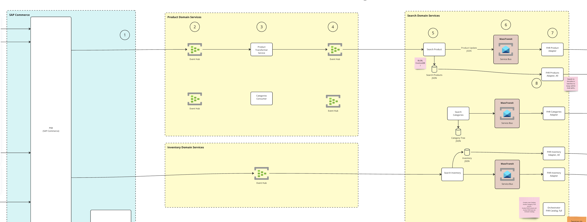

# EDAExercise
**Event Driven Architecture Exercise** is about exploring the latest event driven patterns with a few bits of tech and a library. Key decisions where taken before hand to help focus the decisions to focus in on tech.

1. Utilise [Streaming instead of Messaging](https://risingwave.com/blog/differences-between-messaging-queues-and-streaming-a-deep-dive/) inorder to facilitate event sourcing patterns and horizontal scaling
   - **Messaging Queues**: Messaging queues are a form of middleware that handle messages (data packets) between applications. They ensure that messages sent from a producer service are properly received by a consumer service, even if the consumer is not ready to process them immediately.
   - **Streaming**: Streaming is the continuous transfer of data where data can be processed as it comes in. Streaming platforms allow for real-time data processing, allowing immediate insights and actions based on the incoming data.
2. Utilise [Azure Event Hubs](https://learn.microsoft.com/en-us/azure/event-hubs/event-hubs-about) and [Azure Service bus](https://learn.microsoft.com/en-us/azure/service-bus-messaging/service-bus-messaging-overview) to facilitate the above as well as patterns for throttling
3. Investigate [Kafka](https://kafka.apache.org/) and [Confluent Kafka](https://www.confluent.io/) as alternatives to achieving the same result
4. Utilise a library called [Masstransit.io](https://masstransit.io/) for quick intoduction to patterns on easily accesing consumer and producer patterns and a lot more

## Architectural high level requirments

Below is a very high level diagram representing where this will fit and what the purpose of the event mechanism will be. The future of this could extend to a lot of services but in this narrow vertical, it was SAP -> Product Domain Service -> Search Domain Service. 

The base requirements and ways of working:

1. SAP, as an example,  or **entry system** and tool for creating contracts for providing Product data or source data
   - Investigate https://cloudevents.io/
   - Investigate https://github.com/cloudevents/spec
   - Investigate https://github.com/cloudevents/spec/blob/v1.0.2/cloudevents/bindings/kafka-protocol-binding.md
2. How do we communicate **Topics** or Eventhub **Instances** and **Namespaces**?
3. How does this get created from SAP to the Product Domain Service?
   - Via **REST** or an API facilitated with the Product Domain Service?
   - Using Azure Event Hub direct as a **Producer**?
   - **Other** SAP/Entry Service mechanism?
4. How does the Product Domain Service show its healthy?
   - What happens when it is down and how can it fail - Azure Event Hub is down?
   - What happens when it fails half way?
   - How long do we persist information? How do we read data?
   - What groups do we create and why do we create these groups?
   - What partitions do we create and whic partition applies to who?
   - What happens when the event validation does not succeed liek data is missing or the schema changes?
5. How do we keep the schema versioned?

## What is Cloud Events?

